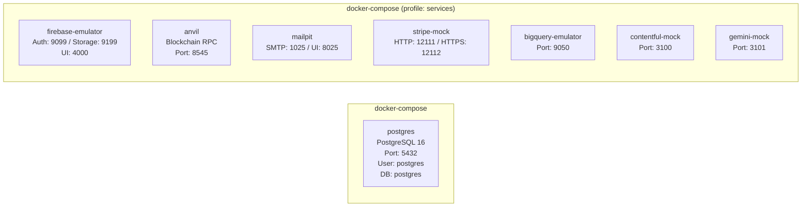
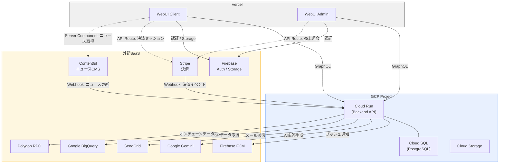
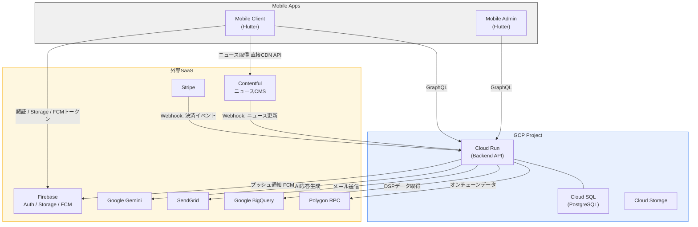
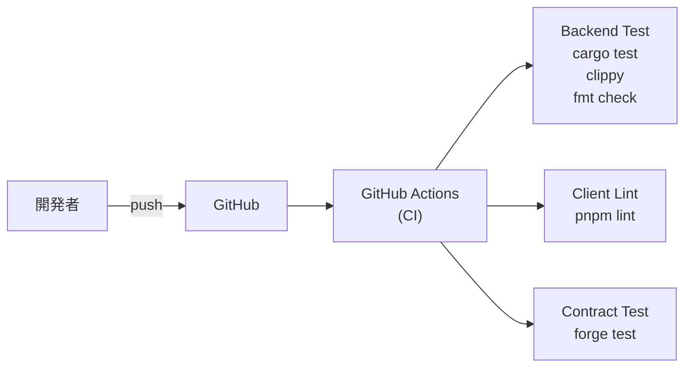
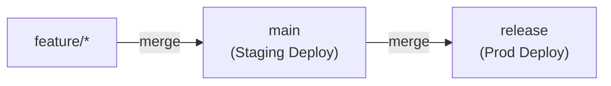

# FRIENDA インフラ構成仕様書

## 1. 概要

本ドキュメントは、FRIENDAプロジェクトの開発環境（Local Development）、ステージング環境（Staging）、本番環境（Production）のインフラ構成を定義する。

### 1.1 クラウドプロバイダー

- **Google Cloud Platform (GCP)**
  - リージョン: `asia-northeast1`（東京）
  - **[Google Cloud プロジェクト一覧](google-cloud-projects.md)**
- **Vercel**（WebUI デプロイ）
- **Firebase**（認証・Storage・FCM）
- **SendGrid**（メール送信）
- **Stripe**（決済サービス）
- **Contentful**（ニュースCMS）
- **Google Gemini**（AI）
- **Google BigQuery**（DSPデータ分析）
- **Polygon**（ブロックチェーンネットワーク）

### 1.2 主要サービス構成

| サービス | 技術スタック | デプロイ先 |
|----------|-------------|-----------|
| Backend API | Rust (Actix-web, Sea-ORM, async-graphql) | Google Cloud Run |
| WebUI Client | Next.js (React, TypeScript) | Vercel |
| WebUI Admin | Next.js (React, TypeScript) | Vercel |
| Mobile Client | Flutter (Dart) | App Store / Google Play |
| Mobile Admin | Flutter (Dart) | App Store / Google Play |
| Database | PostgreSQL 15 | Cloud SQL |
| Smart Contracts | Solidity (Foundry, Hardhat) | Polygon |
| 認証・Storage・FCM | Firebase | SaaS |
| AI | Google Gemini | SaaS |
| DSPデータ分析 | Google BigQuery | SaaS |
| メール送信 | SendGrid | SaaS |
| 決済 | Stripe | SaaS |
| ニュースCMS | Contentful | SaaS |

### 1.3 サービス間通信マトリクス

各サービス層と外部SaaSの通信関係を以下に示す。

| 外部サービス | Backend API | WebUI Client | WebUI Admin | Mobile Client | Mobile Admin |
|---|:---:|:---:|:---:|:---:|:---:|
| **Firebase Auth** | — | 認証 | 認証 | 認証 | — |
| **Firebase Storage** | — | ファイルUP | — | ファイルUP | — |
| **Firebase FCM** | 通知送信 | — | — | トークン登録 | — |
| **Google Gemini** | AI応答生成 | — | — | — | — |
| **Google BigQuery** | DSPデータ取得 | — | — | — | — |
| **SendGrid** | メール送信 | — | — | — | — |
| **Stripe** | Webhook受信 | 決済セッション作成 (※1) | 売上照会 (※1) | — | — |
| **Contentful** | Webhook受信 | ニュース取得 (※1) | — | ニュース取得 (※2) | — |
| **Polygon (RPC)** | オンチェーンデータ取得 | EVMアドレス検証 | — | — | — |

> ※1: Vercel API Route / Server Component 経由（サーバーサイド処理）。ブラウザから外部SaaSへの直接通信ではない
> ※2: モバイルアプリから直接 Contentful CDN API に通信
> ※ Mobile Admin は外部SaaSとの直接通信なし。Backend API（GraphQL）経由でのみデータにアクセスする

---

## 2. 環境一覧

| 項目 | 開発環境 (Local) | ステージング環境 (Staging) | 本番環境 (Prod) |
|------|-----------------|--------------------------|----------------|
| デプロイトリガー | ローカル実行 | `main` ブランチへのpush | `release` ブランチへのpush |
| Cloud Run サービス名 | — | `frienda-server` | `frienda-server-core` |
| Cloud SQL インスタンス名 | — (Docker PostgreSQL) | `frienda-dev-pg` | `frienda-pg` |
| VPC ネットワーク | — | `dev-network` | `frienda-network` |
| Terraform State | — | ローカル | ローカル（GCSバケットは存在するがbackend未設定） |

---

## 3. 開発環境 (Local Development)

#### コンテナ構成（docker-compose）

| 項目 | 設定値 |
|------|--------|
| PostgreSQL バージョン | 16 (**注意**: Cloud SQL は 15) |
| ホスト | 127.0.0.1 |
| ポート | 5432（カスタマイズ可） |
| ユーザー | postgres |
| パスワード | postgres |
| データベース名 | postgres |
| 初期化 | seeds/ 配下のSQLスクリプトを自動実行 |

> **注意**: ローカル開発環境は PostgreSQL 16、ステージング・本番の Cloud SQL は PostgreSQL 15 を使用している。メジャーバージョンの差異により、ローカルでは動作するがクラウド環境で失敗するケースが発生しうる。バージョンの統一を検討すべき。

#### シードデータ実行順序

| 順序 | ファイル | 内容 |
|------|---------|------|
| 1 | `01_init.sql` | 既存テーブル/型の削除 |
| 2 | `02_create_tables.sql` | テーブル作成 |
| 3 | `03_create_functions.sql` | トリガー関数作成（再生数集計） |
| 4 | `04_create_admin_user.sql` | 管理者ユーザー作成 |
| 5 | `05_create_artists.sql` | アーティストデータ |
| 6 | `06_create_upc.sql` | UPC/製品データ |
| 7 | `07_create_tracks.sql` | トラックデータ |
| 8 | `08_create_upctrack.sql` | UPC-トラック関連データ |
| 9 | `09_create_genesis_quests.sql` | ジェネシスクエストデータ |
| 10 | `10_create_prizes.sql` | 賞品データ |

#### ローカルサービス起動

| サービス | コマンド | ポート |
|----------|---------|-------|
| Backend API | `make api-dev` | 8080 |
| WebUI Client | `make webui-client-dev` | 3000 |
| WebUI Admin | `make webui-admin-dev` | 3001 |
| PostgreSQL | `make run-pg` | 5432 |

#### 外部サービス代替コンテナ（プロファイル機能）

本番環境の外部SaaSの代替として、Docker Composeプロファイル機能で必要なサービスのみ起動可能。

| 本番サービス | 代替コンテナ | コマンド | ポート | 備考 |
|---|---|---|---|---|
| Firebase Auth / Storage | Firebase Emulator Suite | `make dev-firebase` | Auth: 9099, Storage: 9199, UI: 4000 | `GCLOUD_PROJECT` 環境変数でプロジェクトID指定 |
| Polygon RPC | Anvil (Foundry) | `make dev-blockchain` | 8545 | ローカルEVMノード |
| SendGrid | Mailpit | `make dev-mail` | SMTP: 1025, UI: 8025 | Web UIでメール内容確認可能 |
| Stripe | stripe-mock | `make dev-stripe` | HTTP: 12111, HTTPS: 12112 | Stripe公式モック |
| Google BigQuery | bigquery-emulator | `make dev-bigquery` | 9050 | `--port 9050` 明示指定 |
| Contentful | カスタムモックサーバー | `make dev-contentful` | 3100 | Bearer トークン存在チェック、ヘルスチェック対応 |
| Google Gemini | カスタムモックサーバー | `make dev-gemini` | 3101 | generateContent (v1/v1beta) 対応、ヘルスチェック対応 |

- 全サービスを一括起動（PostgreSQL含む）: `make dev-all`
- エミュレーター/モックのみ一括起動: `make dev-services`
- 停止: `make stop-services` / 削除: `make down-services`

> **カスタムモックサーバーの構成**: Contentful・Gemini モックは `docker/` 配下にカスタム Express.js サーバーとして実装。`npm ci` による再現可能なビルド、`.dockerignore` によるコンテキスト軽量化、`healthcheck` ディレクティブによるコンテナ状態監視に対応。

---

## 4. クラウド環境構成図（ステージング・本番共通）

> ステージング環境と本番環境はサービス構成・通信経路が同一のため、構成図は共通とする。環境固有のリソース名・設定値は[セクション5（ステージング）](#5-ステージング環境-staging)・[セクション6（本番）](#6-本番環境-production)を参照。

### 4.1 Web構成図

> **凡例**: 実線 = 直接通信、破線 = Vercelサーバーサイド経由（API Route / Server Component）

### 4.2 Mobile構成図

---

## 5. ステージング環境 (Staging)

### 5.1 Cloud Run 設定

| 項目 | 設定値 |
|------|--------|
| サービス名 | `frienda-server` |
| リージョン | `asia-northeast1` |
| イングレス | `INGRESS_TRAFFIC_ALL`（公開） |
| IAM | `allUsers` に `run.invoker` 付与（未認証アクセス許可） |
| VPC接続 | VPC Access Connector 経由 |
| スケーリング | デフォルト（未設定） |

### 5.2 Cloud SQL 設定

| 項目 | 設定値 |
|------|--------|
| インスタンス名 | `frienda-dev-pg` |
| バージョン | PostgreSQL 15 |
| マシンタイプ | `db-custom-1-3840` |
| IP | プライベートIPのみ（`10.10.0.0/16`） |
| 削除保護 | 有効（`google_sql_database_instance` のデフォルトは `true`。明示的な記述なし） |
| バックアップ | 未設定 |
| パスワード管理 | Terraform変数から指定 |

### 5.3 Cloud Storage 設定

| バケット名 | 用途 | ストレージクラス | ライフサイクル |
|-----------|------|----------------|--------------|
| `frienda-photo-storage` | 写真保存 | STANDARD | 365日後にNEARLINEへ遷移 |
| `frienda-general-files` | 汎用ファイル | STANDARD | 30日後にCOLDLINEへ遷移、バージョニング有効 |

---

## 6. 本番環境 (Production)

### 6.1 Cloud Run 設定

| 項目 | 設定値 |
|------|--------|
| サービス名 | `frienda-server-core` |
| リージョン | `asia-northeast1` |
| イングレス | `INGRESS_TRAFFIC_ALL`（公開） |
| IAM | `allUsers` に `run.invoker` 付与（未認証アクセス許可） |
| VPC接続 | VPC Access Connector (`prod-connector`) 経由 |
| 最小インスタンス数 | 1（コールドスタート回避） |
| 最大インスタンス数 | 10 |

### 6.2 Cloud SQL 設定

| 項目 | 設定値 |
|------|--------|
| インスタンス名 | `frienda-pg` |
| バージョン | PostgreSQL 15 |
| マシンタイプ | `db-custom-1-3840` |
| IP | プライベートIPのみ（`10.10.0.0/16`） |
| 削除保護 | **有効** |
| バックアップ | **有効**（毎日 02:00 UTC） |
| ポイントインタイムリカバリ | **有効** |
| パスワード管理 | `random_password` リソースで自動生成（16文字、特殊文字なし） |

### 6.3 Cloud Storage 設定

| バケット名 | 用途 | ストレージクラス | ライフサイクル |
|-----------|------|----------------|--------------|
| `prd-frienda-general-files` | 汎用ファイル | STANDARD | 30日後にCOLDLINEへ遷移、バージョニング有効 |

### 6.4 Terraform State 管理

| 項目 | 設定値 |
|------|--------|
| バケット名 | `frienda-terraform-state` |
| リージョン | `us-west1` |
| バージョニング | 有効（5世代保持） |
| 公開アクセス | 禁止（GCSデフォルト動作に依存） |

> **要対応**: Terraform定義に `public_access_prevention = "enforced"` が明示されていない。現在はGCSのデフォルト動作により公開アクセスが防止されているが、明示的に設定を追加してポリシーを確実にすべき。

> **要対応**: GCSバケット `prd-frienda-terraform-state` は存在するが、`terraform/environments/prod/main.tf` に `terraform { backend "gcs" { ... } }` の設定がなく、Terraform State は実際にはローカル管理のままである。リモートバックエンドの設定を追加し、チームでの状態共有・ロック機能を有効化すべき。

> ステージング・本番の環境間差異は[セクション11「環境間差異サマリー」](#11-環境間差異サマリー)を参照。

---

## 7. CI/CD パイプライン

### 7.1 全体フロー

### 7.2 Claude Code ワークフロー (`claude.yml`)

| 項目 | 設定 |
|------|------|
| トリガー | Issue/PRコメントで `@claude` メンション時 |
| 用途 | AI によるコードレビュー・Issue対応の自動化（開発支援ツール） |
| 実行環境 | `anthropics/claude-code-action@beta` |

> **注意**: ビルド・デプロイには関与しない開発支援用ワークフロー。

### 7.3 CI ワークフロー (`ci.yaml`)

| トリガー | 条件 |
|---------|------|
| push | ブランチ指定なし（パス指定: `services/backend/**`, `services/frontend/apps/{admin,client,mobile}/**`, `services/contract/**`） |
| pull_request | `main`, `develop` ブランチ（パス指定: 同上） |

> **要修正（優先度: 高）**: ci.yaml のパス指定は `services/frontend/` を参照しているが、現在のディレクトリ構造では `services/webui/` に変更されている。このパス不一致により、CIのpushトリガーが発火せず、Clientジョブの `pnpm lint`（作業ディレクトリも `path: 'services/frontend'` を指定）も正しく実行されていない可能性が高い。ci.yaml のパス指定と各ジョブの `path` パラメータを `services/webui/` に修正すべき。

| ジョブ | 実行条件 | 内容 |
|--------|---------|------|
| Backend | コミットメッセージに "backend" | `cargo test`, `cargo clippy`, `cargo fmt --check` |
| ~~Admin~~ | ~~コミットメッセージに "admin"~~ | ~~`pnpm install`, `pnpm lint`（Node.js 18/20 マトリクスビルド）~~ **※コメントアウト中** |
| Client | コミットメッセージに "client" | `pnpm install`, `pnpm lint`（Node.js 18/20 マトリクスビルド） |
| Contract | コミットメッセージに "contract" | `forge install`, `forge test` |

### 7.4 デプロイワークフロー

#### ステージング環境デプロイ (`deploy_dev_server.yaml`)

| 項目 | 設定 |
|------|------|
| トリガー | `main` ブランチへのpush（`services/backend/**` 変更時） |
| ビルド | `docker build --platform linux/amd64 -f Dockerfile.server` |
| レジストリ | `asia-northeast1-docker.pkg.dev/$PROJECT_ID/$SERVICE_NAME/$IMAGE:latest` |
| デプロイ先 | Cloud Run `frienda-server` |
| 環境変数 | 30以上のシークレットをCloud Runに設定 |

#### 本番環境デプロイ (`deploy_prd_server.yaml`)

| 項目 | 設定 |
|------|------|
| トリガー | `release` ブランチへのpush（`services/backend/**` 変更時） |
| ビルド | ステージング環境と同一プロセス |
| レジストリ | 本番用Artifact Registry |
| デプロイ先 | Cloud Run `frienda-server-core` |
| 環境変数 | 本番用シークレットを使用 |

> **要確認**: `auth`ステップ(L53)では`GCLOUD_AUTH_PRD`（本番用）を使用しているが、`Setup Google Cloud`ステップ(L58)では`GCLOUD_AUTH`（PRD接尾辞なし）を使用している。さらに、同ステップの`project_id`も`secrets.PROJECT_ID`（PRD接尾辞なし）を参照しており、env定義の`secrets.GCP_PROJECT_ID_PRD`と不整合がある。
> ステージング側（`deploy_dev_server.yaml`）では`auth`・`Setup Google Cloud`の両ステップで一貫して`GCLOUD_AUTH` / `PROJECT_ID` を使用しており整合している。本番ワークフローは`auth`ステップのみ`_PRD`付きに変更されたが、`Setup Google Cloud`ステップが未更新のまま残っている可能性が高い。`GCLOUD_AUTH_PRD` / `GCP_PROJECT_ID_PRD` への統一を検討すべき。
> また、`setup-gcloud@v2` の `service_account_key` パラメータは非推奨（deprecated）である。`google-github-actions/auth@v2` による認証に統一し、`Setup Google Cloud` ステップからの `service_account_key` / `project_id` 指定を削除すべき。

#### 定期ジョブ (`credential_update.yaml`)

| 項目 | 設定 |
|------|------|
| スケジュール | 毎月15日 12:00 UTC（cron: `0 12 15 * *`） |
| 処理内容 | DSP認証情報の更新 |
| 対象 | ステージング → 本番（順次実行） |

> **注意**: yaml内のコメントには「毎月28日」と記載されているが、実際のcron式は15日実行である。yaml内コメントの修正を別途検討すべき。

### 7.5 デプロイブランチ戦略

---

## 8. Docker イメージ構成

### 8.1 Backend サーバー (`Dockerfile.server`)

| 項目 | 設定値 |
|------|--------|
| ビルドステージ | `rust:1.94.1-bookworm` |
| ランタイム | `gcr.io/distroless/cc-debian12` |
| ビルド対象 | `server-core` |
| ビルドモード | release |
| ポート | 8080 |
| 起動方式 | `ENTRYPOINT ["/server-core"]` |
| 含まれるファイル | Firebase認証JSONファイル（下記2ファイル） |

**Firebase認証JSONファイル:**

| ファイル名 | 用途 |
|-----------|------|
| `frienda-auth-test1-a490c287d01b.json` | ステージング環境用 |
| `friendship-dao-firebase-adminsdk-a2w15-e1854b252a.json` | 本番環境用 |

> **セキュリティ上の懸念**: 現在、ステージング用・本番用の両方のFirebase認証JSONが単一のDockerイメージに含まれている。環境ごとにイメージを分離するか、Secret Managerからの動的取得への移行を検討すべき。

### 8.2 Backend エクステンション (`Dockerfile.extension`)

| 項目 | 設定値 |
|------|--------|
| ビルドステージ | `rust:1.83.0` |
| ランタイム | `gcr.io/distroless/cc-debian12` |
| ビルド対象 | `server-extension` |
| ビルドモード | release |
| ポート | 8080 |
| 起動方式 | `CMD ["./server-extension"]` |

> **注意**: server-core は `ENTRYPOINT`、server-extension は `CMD` を使用している。`ENTRYPOINT` はコンテナ実行時に引数で上書きできないが、`CMD` は上書き可能。現状では動作上の差異はないが、起動方式の統一を検討すべき。

> **注意**: Rustバージョンが server-core (`1.94.1`) と server-extension (`1.83.0`) で大きく異なる。ビルド再現性やセキュリティパッチの観点から、バージョンの統一を検討すべき。また、Dockerfileでのバージョン指定に加えて `rust-toolchain.toml` での一元管理を導入し、ローカル開発とCI/CDビルドでのバージョン整合性を確保することを推奨。

> **注意**: `server-extension` に対応するデプロイワークフロー（GitHub Actions）は存在しない。現在は手動デプロイまたは未使用の状態。CI/CDパイプラインへの組み込みが必要な場合は、`deploy_dev_server.yaml` を参考にワークフローを作成すべき。

### 8.3 PostgreSQL (`services/postgres/Dockerfile`)

| 項目 | 設定値 |
|------|--------|
| ベースイメージ | `postgres:16` |
| 初期化 | `seeds/` をdocker-entrypoint-initdb.dにコピー |

---

## 9. 環境変数一覧

> **出典について**: デプロイワークフロー（`deploy_dev_server.yaml` / `deploy_prd_server.yaml`）と各サービスの `.env.example` を元に記載。ワークフロー内の出典は以下の2種類に区別する:
> - **env**: ワークフローファイル冒頭の `env:` ブロックで定義
> - **deploy**: `gcloud run deploy` の `--set-env-vars` でインライン参照（`env:` ブロックに含まれない）

### 9.1 Backend API

| カテゴリ | 変数名 | 用途 | 出典 |
|---------|--------|------|------|
| データベース | `DATABASE_URL` | PostgreSQL接続文字列 | env |
| サーバー | `HOST`, `PORT` | リッスンアドレス（0.0.0.0:8080） | .env.example |
| 環境 | `ENV`, `ENVIRONMENT` | 環境識別（dev/prod） | deploy (`ENVIRONMENT`) / .env.example (`ENV`) |
| 認証 | `JWK_URL`, `JWK_ISSUER` | Firebase JWT検証 | .env.example |
| AI | `GEMINI_API_KEY` | Gemini API | deploy |
| メール | `SENDGRID_API_KEY` | SendGrid | deploy |
| ブロックチェーン | `ETH_RPC_URL`, `CREDENTIAL_CONTRACT_ADDRESS` | Ethereum連携 | env |
| DSP | `SERVICE_ACCOUNT_DSP` | DSPサービスアカウント | env |
| DSP | `SCR_SERVICE_ACCOUNT_DSP` | SCR DSPサービスアカウント | env |
| DSP | `CLIENT_ID`, `CLIENT_SECRET` | DSPクライアント認証 | env |
| DSP | `DSP_QUERY_DAILY_TEMPLATE` | DSP日次クエリテンプレート | env |
| DSP | `DSP_QUERY_MONTHLY_TEMPLATE` | DSP月次クエリテンプレート | env |
| DSP | `SCR_DSP_QUERY_DAILY_TEMPLATE` | SCR DSP日次クエリテンプレート | env |
| DSP | `LOCATION`, `SCR_LOCATION` | BigQueryロケーション | env |
| DSP | `DSP_PJ_ID`, `SCR_DSP_PJ_ID` | BigQueryプロジェクトID | env |
| DSP | `GENDER_GEN_PLAYBACK_URL` | Gender Generation 再生URL | env |
| DSP | `GENDER_GEN_PLAYBACK_PREFIX` | Gender Generation 再生プレフィクス | env |
| DSP | `GENDER_GEN_AUTH_URL` | Gender Generation 認証URL | env |
| セキュリティ | `HASH_SALT` | ハッシュソルト | env |

### 9.2 WebUI Client

| カテゴリ | 変数名 | 用途 |
|---------|--------|------|
| 環境 | `NEXT_PUBLIC_ENV` | 環境識別 |
| API | `NEXT_PUBLIC_GRAPHQL_ENDPOINT` | GraphQLエンドポイント |
| CMS | `CONTENTFUL_SPACE_ID`, アクセストークン | Contentful連携 |
| 認証 | Firebase設定（PROJECT_ID等） | Firebase認証 |
| 決済 | `STRIPE_SECRET_KEY` | Stripe連携 |

### 9.3 WebUI Admin

| カテゴリ | 変数名 | 用途 |
|---------|--------|------|
| 認証 | `BASIC_AUTH_USER`, `BASIC_AUTH_PASSWORD` | Basic認証 |
| API | `NEXT_PUBLIC_GRAPHQL_ENDPOINT` | GraphQLエンドポイント |
| 決済 | `STRIPE_SECRET_KEY` | Stripe連携 |

### 9.4 Smart Contracts

| カテゴリ | 変数名 | 用途 |
|---------|--------|------|
| ガス | `GAS_REPORT` | ガスレポート出力 |
| ネットワーク | `INFURA_KEY` | Infuraノード接続 |
| デプロイ | `DEPLOYER_PRIVATE_KEY`, `MNEMONIC` | デプロイ用秘密鍵 |
| 検証 | `ETHERSCAN_KEY` | Etherscanコントラクト検証 |

---

## 10. 認証・セキュリティ

### 10.1 認証方式

| レイヤー | 方式 | 詳細 |
|---------|------|------|
| ユーザー認証 | Firebase Authentication | フロントエンド（Next.js API Route）でのJWTトークン検証。**バックエンドのJWT検証ミドルウェアは無効化中（#25 参照）** |
| 管理画面（ゲート） | Basic Authentication | Next.js middleware によるページアクセス制御 |
| 管理画面（アプリ内） | Firebase Authentication | 管理者ユーザーの認証・状態管理 |
| API間通信 | サービスアカウント | GCPサービスアカウント |
| 決済 | Stripe Webhook | Webhook署名検証 **（未実装 — #23 参照）** |

### 10.2 ネットワークセキュリティ

| 項目 | 設定 |
|------|------|
| Cloud SQL | プライベートIPのみ（VPC経由でアクセス） |
| Cloud Run → Cloud SQL | VPC Access Connector 経由 |
| Cloud Run イングレス | 全トラフィック許可（`--allow-unauthenticated`） |

> **セキュリティリスク**: 現在、Cloud Run はデプロイ時に `--allow-unauthenticated` フラグを使用しており、IAM による認証なしで全インターネットからアクセス可能な状態である。APIレイヤーでの認証（Firebase JWT検証）は実装済みだが、インフラレイヤーでの防御がない。以下の対策を優先的に検討すべき:
> - Cloud Load Balancing + Cloud Armor によるDDoS防御・WAF導入
> - Identity-Aware Proxy (IAP) による管理画面のアクセス制限
> - Cloud Run イングレスを `INGRESS_TRAFFIC_INTERNAL_LOAD_BALANCER` に変更し、ロードバランサー経由のみに制限

---

## 11. 環境間差異サマリー

| 項目 | 開発 (Local) | ステージング (Staging) | 本番 (Prod) |
|------|-------------|----------------------|-------------|
| **環境** | ローカル (Docker) | GCP | GCP |
| **Cloud Run サービス名** | — | `frienda-server` | `frienda-server-core` |
| **Cloud Run 最小インスタンス** | — | 0（デフォルト） | 1 |
| **Cloud Run 最大インスタンス** | — | デフォルト | 10 |
| **Cloud SQL インスタンス名** | — (Docker PostgreSQL 16) | `frienda-dev-pg` | `frienda-pg` |
| **Cloud SQL マシンタイプ** | — | `db-custom-1-3840` | `db-custom-1-3840` |
| **Cloud SQL バックアップ** | — | なし | あり (PITR, 02:00 UTC) |
| **Cloud SQL 削除保護** | — | あり（デフォルト） | あり（明示設定） |
| **Cloud SQL パスワード** | `postgres` | 変数指定 | 自動生成 |
| **VPC ネットワーク** | — | `dev-network` | `frienda-network` |
| **ストレージバケット** | — | 2個（photo, general） | 1個（general） |
| **Terraform State** | — | ローカル | ローカル（GCSバケットは存在するがbackend未設定） |
| **デプロイ方法** | ローカル実行 | `main` ブランチへのpush | `release` ブランチへのpush |
| **IAM** | — | allUsers許可 | allUsers許可 |

---

## 12. 今後の改善事項

### 12.1 ステージング環境の強化

- [ ] ステージング環境のリソース名を `dev-` プレフィクスから `stg-` プレフィクスへリネーム検討
- [ ] Cloud SQL バックアップの有効化
- [ ] Cloud SQL 削除保護の明示的設定（現在はTerraformデフォルト `true` に依存）
- [ ] Terraform State のリモート管理化 → [12.2 セキュリティ強化（優先度: 高）](#122-セキュリティ強化)参照

### 12.2 セキュリティ強化

**優先度: 高**（本文中のセキュリティ指摘事項）

- [x] **Firebase認証JSONのイメージ分離**: 環境ごとの `FIREBASE_KEY_FILE` build-arg により分離済み（[セクション8.1](#81-backend-サーバー-dockerfileserver)参照）
- [x] **Cloud Run未認証アクセスの制限**: GCLB + Cloud Armorを導入し、イングレスを `INTERNAL_LOAD_BALANCER` に変更済み（[セクション10.2](#102-ネットワークセキュリティ)参照）
- [x] **Terraform State のリモート管理化**: GCSバックエンドを設定済み（[セクション6.4](#64-terraform-state-管理)参照）
- [x] **GCS public_access_prevention の明示的設定**: 全バケットに `enforced` を設定済み（[セクション6.4](#64-terraform-state-管理)参照）
- [x] **deploy_prd_server.yaml の認証情報不整合**: `GCLOUD_AUTH_PRD` への統一と現代的な認証パターンへの移行済み（[セクション7.4](#74-デプロイワークフロー)参照）
- [x] **ci.yaml のパス指定不整合**: `services/webui/` への修正済み（[セクション7.3](#73-ci-ワークフロー-ciyaml)参照）
- [x] **credential_update.yaml の実行スケジュール不整合**: 毎月28日実行に修正済み（[セクション7.4](#74-デプロイワークフロー)参照）
- [ ] **Stripe Webhook署名検証の実装**（[セクション10.1](#101-認証方式)参照、#23 参照）
- [x] **バックエンドGraphQLエンドポイントのトークン検証有効化**: JWT検証ミドルウェアを有効化済み（[セクション10.1](#101-認証方式)参照、#25 参照）
- [x] **招待メール配信のハードコードパスワードの環境変数化**: `INVITATION_PASSWORD` 環境変数を導入済み（#26 参照）
- [ ] **ポイント送付時のトランザクション整合性修正**（#22 参照）
  - **現状の課題**: `transfer` 処理において、送信元・送信先・履歴作成のDB操作が単一のトランザクションで囲まれておらず、途中でエラーが発生した場合にデータの不整合（二重引き落としや履歴欠落など）が発生するリスクがある。
  - **今後の対応**: Sea-ORM の `TransactionTrait` を使用し、Usecase 層でリポジトリ層の操作をトランザクション管理するようにリファクタリングが必要。

**優先度: 中**

- [ ] Identity-Aware Proxy (IAP) による管理画面アクセス制限
- [ ] Cloud SQL への接続をCloud SQL Auth Proxyに統一
- [ ] シークレット管理をGitHub SecretsからGoogle Secret Managerへ移行検討

### 12.3 可用性・監視

- [ ] Cloud Monitoring アラートポリシーの設定
- [ ] Cloud Logging のログベースメトリクス設定
- [ ] アップタイムチェックの導入
- [ ] エラーレポート（Error Reporting）の有効化

### 12.4 コスト最適化

- [ ] 不要リソースの定期棚卸しフロー整備
- [ ] Cloud RunのCPU割り当て最適化（request-based vs always-on）

---

## 改訂履歴

| 日付 | バージョン | 内容 |
|------|-----------|------|
| 2026-04-10 | 1.0 | 初版作成 |
| 2026-04-10 | 1.1 | 外部サービス代替コンテナの詳細情報を追記（ヘルスチェック、認証チェック、カスタムモック構成） |
