# 処理フロー図（シーケンス図）

各機能の処理フローをシーケンス図で示します。  
本ドキュメントはソースコードの実装に基づいて作成されています。

---

## 目次

1. [サインイン](#サインイン)
2. [認証](#認証)
3. [クエスト](#クエスト)
4. [ポイントシステム（購入時）](#ポイントシステム購入時)
5. [ポイントシステム（送付時）](#ポイントシステム送付時)
6. [ポイントシステム（特典ポイント）](#ポイントシステム特典ポイント)
7. [ポイントシステム（FSP配分）](#ポイントシステムfsp配分)
8. [ポイントシステム（FSPからクレデンシャルに変換）](#ポイントシステムfspからクレデンシャルに変換)
9. [タスクマッチング（作成時）](#タスクマッチング作成時)
10. [タスクマッチング（完了時）](#タスクマッチング完了時)
11. [AIチャットボット](#aiチャットボット)
12. [クレジット入力時の招待メール配信](#クレジット入力時の招待メール配信)
13. [景品交換](#景品交換)

---

## サインイン

ユーザーはクライアントアプリケーションを通じて、メールアドレスとパスワードを用いてFirebase Authでサインインまたはサインアップを行います。サインアップ時はメール認証を経てプロフィール設定を行い、GraphQL mutationでバックエンドにユーザーレコードを作成します。サインイン時はFirebase ID Tokenを取得し、Next.js API Routeでトークンを検証した後、GraphQLでユーザー情報を取得します。セッションはHTTP-only cookieで管理されます。

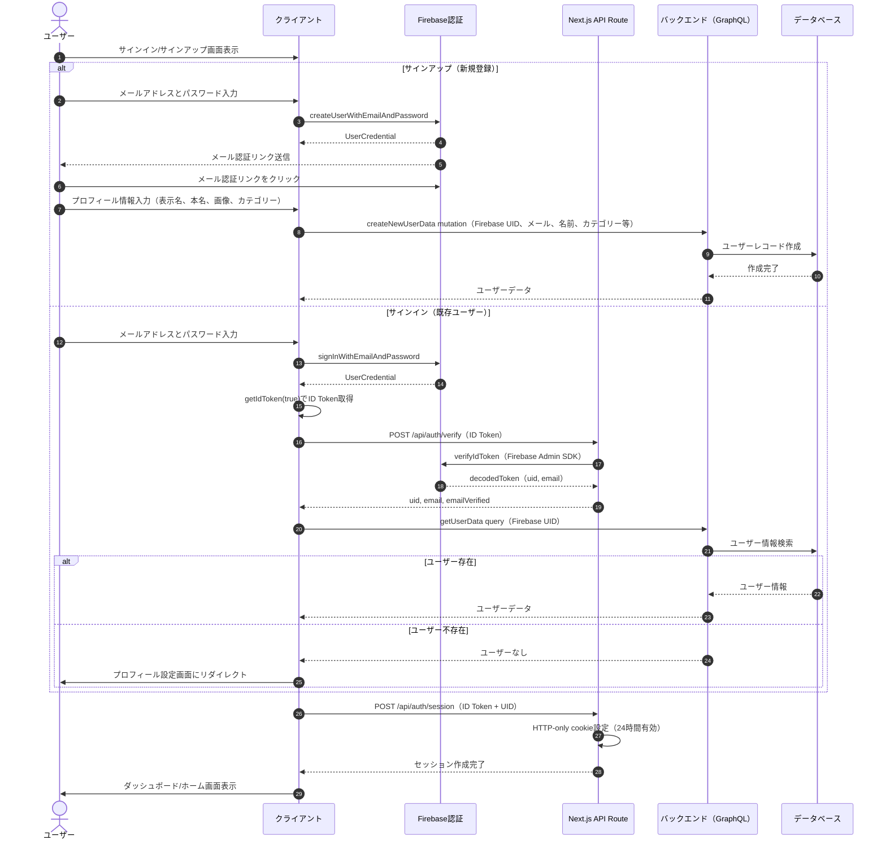

---

## 認証

認証済みユーザーのリクエストはNext.js middlewareでセッションcookieの存在を確認します。セッションcookieにはFirebase ID TokenとUIDが含まれます。バックエンドのGraphQLエンドポイントは現在トークン検証を行っておらず、クライアントがuser_idをパラメータとして明示的に渡します。

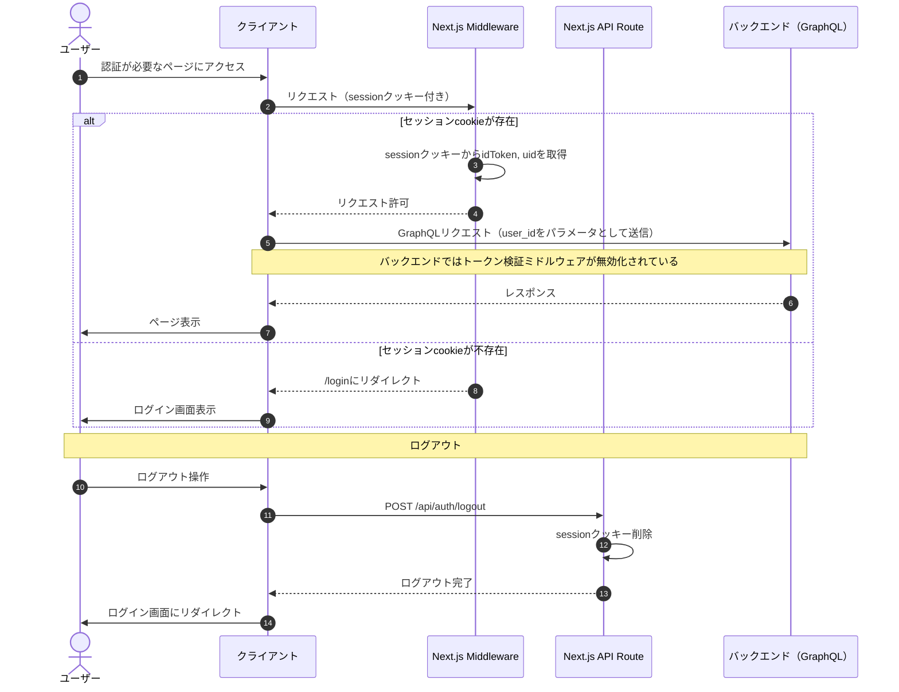

---

## クエスト

クエストはシステム管理型で、シード データとして事前登録されています（「ログインボーナス」「プロフィールを編集しよう」等）。ユーザーはクエスト一覧から未完了のクエストを閲覧し、完了報告を行います。クエストにオーナー概念はなく、ポイントの自動移転もありません。ログインボーナスは日次で1FSPが付与されます。

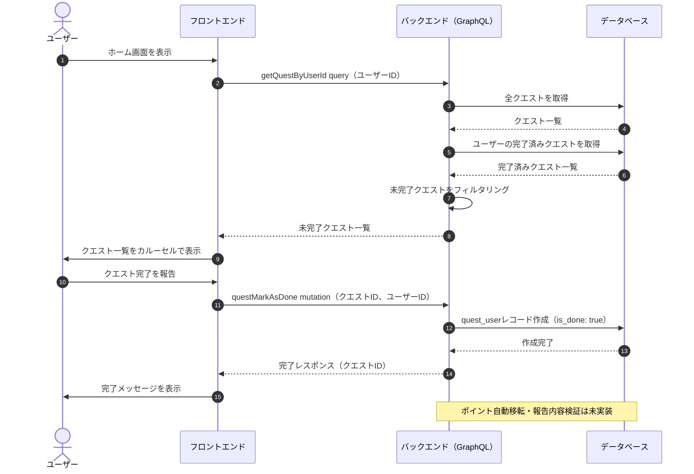

---

## ポイントシステム（購入時）

ユーザーはフロントエンドからポイント購入ページを開き、固定の購入オプション（100/300/500/1000/5000 FSP）から選択します。Next.js API RouteでStripe Checkout Sessionを作成し、ユーザーをStripeの決済ページにリダイレクトします。決済完了後、Stripeからバックエンドにwebhook（checkout.session.completed）が送信され、内部的にtransfer(from: None)を経由してユーザーのポイントが加算されます。ポイント受取時にDB通知・FCMプッシュ通知・SendGridメール通知が非同期で送信されます。なお、Webhook署名検証は現在未実装です。

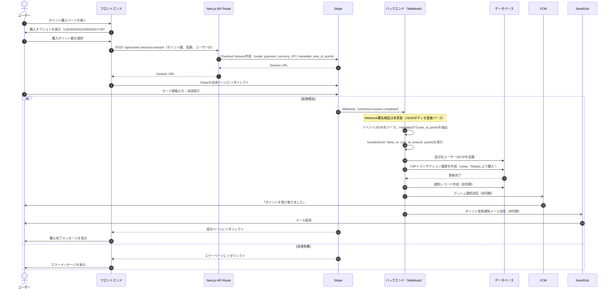

---

## ポイントシステム（送付時）

ユーザーはフロントエンドからポイント送付ページを開き、送付先ユーザー（ユーザー名またはメールアドレス）とポイント数を入力します。createFspTx mutationは内部的にtransfer_by_username_or_emailを呼び出し、先に送付先ユーザーのFSPを加算した後、送付元ユーザーの残高チェック・FSP減算を行います。送付完了後、受取側ユーザーにのみDB通知・FCMプッシュ通知・SendGridメール通知が送信されます。

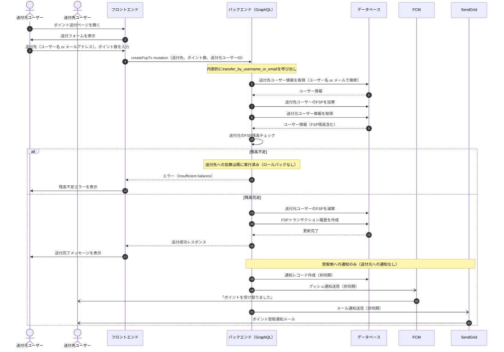

---

## ポイントシステム（特典ポイント）

現在実装されている特典ポイントはログインボーナスのみです。ユーザーがログインすると、バックエンドは最終ログイン日時を確認し、当日初回ログインの場合に1FSPを付与します。

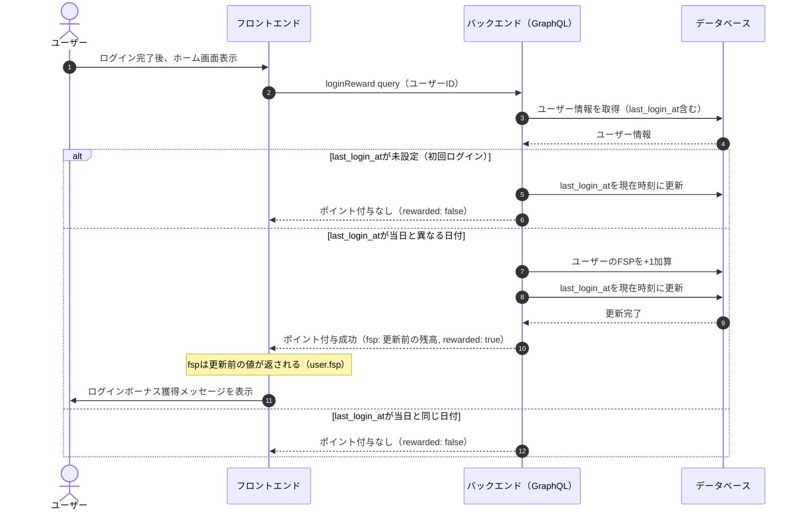

---

## ポイントシステム（FSP配分）

管理者はバックエンドのGraphQL mutation（createBulkFspTx）を通じて、一括でユーザーにFSPを配分できます。データベースは単一のPostgreSQLで、組織とユーザーのデータは同一DB内に存在します。送付元にはアーティストアカウント（artist_*）も指定可能で、その場合はアーティストのFSPから減算されます。なお、bulk_transferでは通知（DB通知・FCM・SendGrid）は送信されません。

```mermaid
sequenceDiagram
    autonumber

    actor 管理者
    participant 管理画面 as 管理画面（Admin）
    participant バックエンド as バックエンド（GraphQL）
    participant データベース

    管理者->>管理画面: FSP配分画面を開く
    管理画面->>バックエンド: システム概要を取得（総配布ポイント数等）
    バックエンド->>データベース: データ取得
    データベース-->>バックエンド: システム概要情報
    バックエンド-->>管理画面: ダッシュボード表示

    管理者->>管理画面: 配分対象ユーザーとポイント数を入力
    管理画面->>バックエンド: createBulkFspTx mutation（配分リスト）

    loop 各対象ユーザーについて
        alt 送付元がアーティストアカウント（artist_*）
            バックエンド->>データベース: アーティストのFSP残高チェック
            alt 残高不足
                バックエンド-->>管理画面: エラー（Insufficient artist balance）
            else 残高充足
                バックエンド->>データベース: アーティストFSP減算
            end
        else 送付元が通常ユーザー
            バックエンド->>データベース: ユーザーのFSP残高チェック
            alt 残高不足
                バックエンド-->>管理画面: エラー（Insufficient balance）
            else 残高充足
                バックエンド->>データベース: 送付元ユーザーFSP減算
            end
        else 送付元が管理者アカウント
            Note over バックエンド: 残高チェック・減算をスキップ
        end
        バックエンド->>データベース: 対象ユーザーFSP加算
        end
    end

    バックエンド->>データベース: FSPトランザクション履歴を一括作成（create_many）
    データベース-->>バックエンド: 作成完了

    Note over バックエンド: bulk_transferでは通知（DB通知・FCM・SendGrid）は送信されない

    バックエンド-->>管理画面: 配分完了レスポンス
    管理画面->>管理者: 配分結果を表示
```

---

## ポイントシステム（FSPからクレデンシャルに変換）

クレデンシャルはERC20トークン（Credential.sol）としてブロックチェーン上に存在します。FSPからクレデンシャルへの直接変換ではなく、スマートコントラクトのMINTER_ROLEがクレデンシャルを各ウォレットアドレスにmintし、バックエンドのパイプライン処理がオンチェーンのクレデンシャル残高を定期的にデータベースに同期します。クレデンシャルはユーザー間で転送不可（mint/burnのみ可）です。

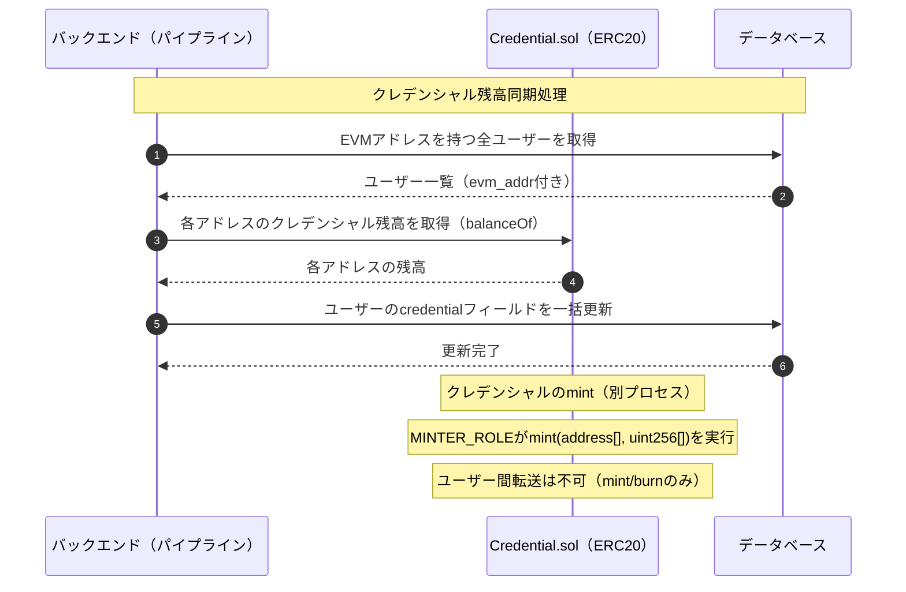

---

## タスクマッチング（作成時）

内部的に「オファー」と呼ばれるタスクをオーナーがシステムに公開します。ユーザーがオファーにアプライすると、オーナーに通知が送信されます。オーナーがアプライを承認するとステータスが「Ongoing」に変更され、他のアプライはキャンセルされます。メッセージ機能により、オーナーとユーザー間でコミュニケーションが可能です。

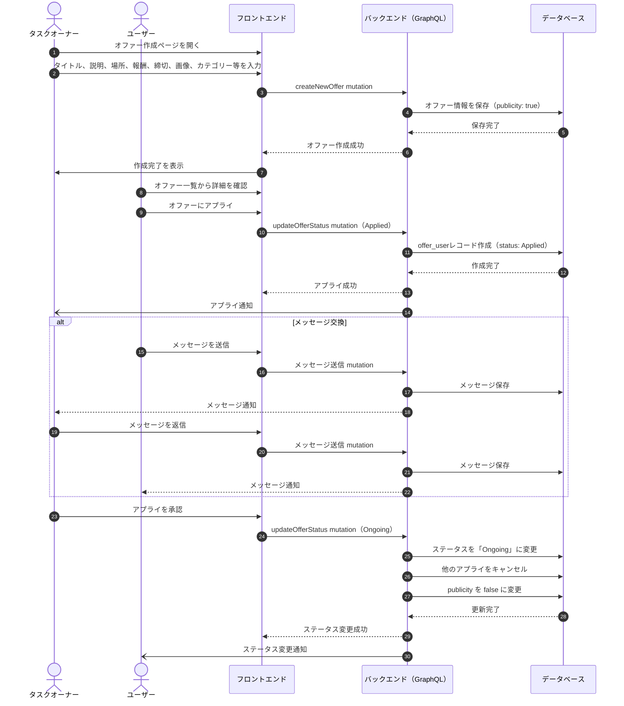

---

## タスクマッチング（完了時）

タスクオーナーがオファーのステータスを「Finished」に変更すると、報酬FSPがオーナーから担当ユーザーに自動的に移転されます。担当ユーザーにはDB通知・FCMプッシュ通知・SendGridメール通知が送信されます。

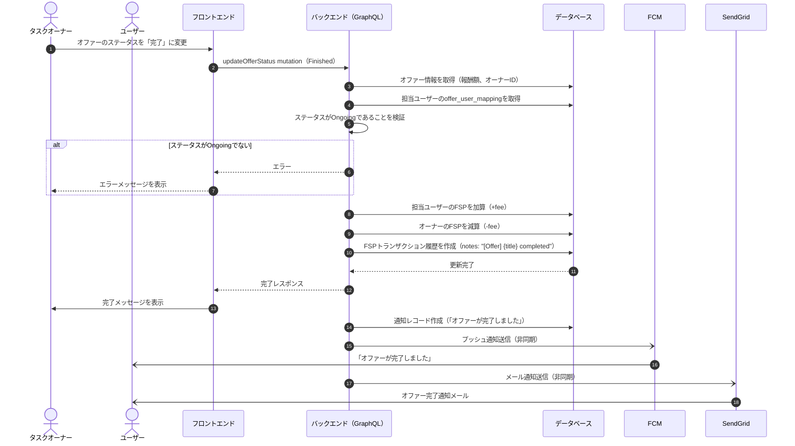

---

## AIチャットボット

ユーザーがチャットボットUIに質問を送信すると、バックエンドはユーザー情報に加え、所属アーティスト情報、アクティブなオファー情報、リリースの再生データ（過去6ヶ月・7日分）をコンテキストとして構築し、Google Gemini 2.0 Flash APIにリクエストします。

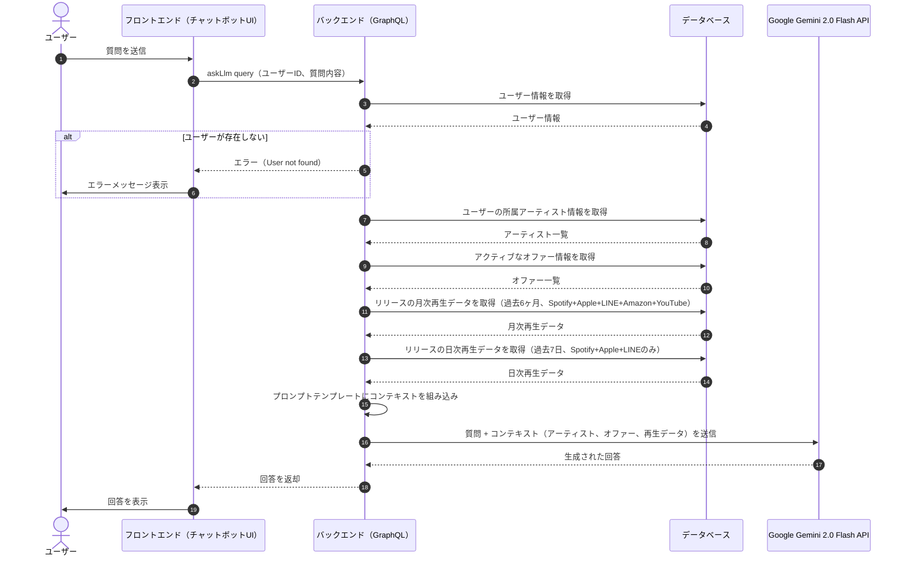

---

## クレジット入力時の招待メール配信

入力ユーザーがクレジット情報（ISRC、ロール、名前、メールアドレス）を登録すると、バックエンドはUUIDベースの招待コード（digest_code）を生成し、招待レコードを作成します。招待処理の実行にはハードコードされたパスワード認証が必要です。SendGridを用いて招待メールを送信し、招待されたユーザーは招待コードを使ってアカウントを作成します。

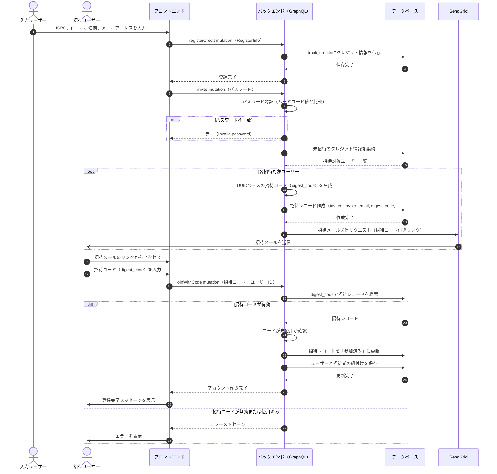

---

## 景品交換

ユーザーはFSPポイントを使って景品と交換できます。モバイルアプリユーザーはQRコードが生成され、景品提供者がQRコードをスキャンして利用を確定します。Webユーザーはボタン操作で交換・利用申請を行います。景品利用時はrepresentation_user_id（景品提供者）の検証が行われます。

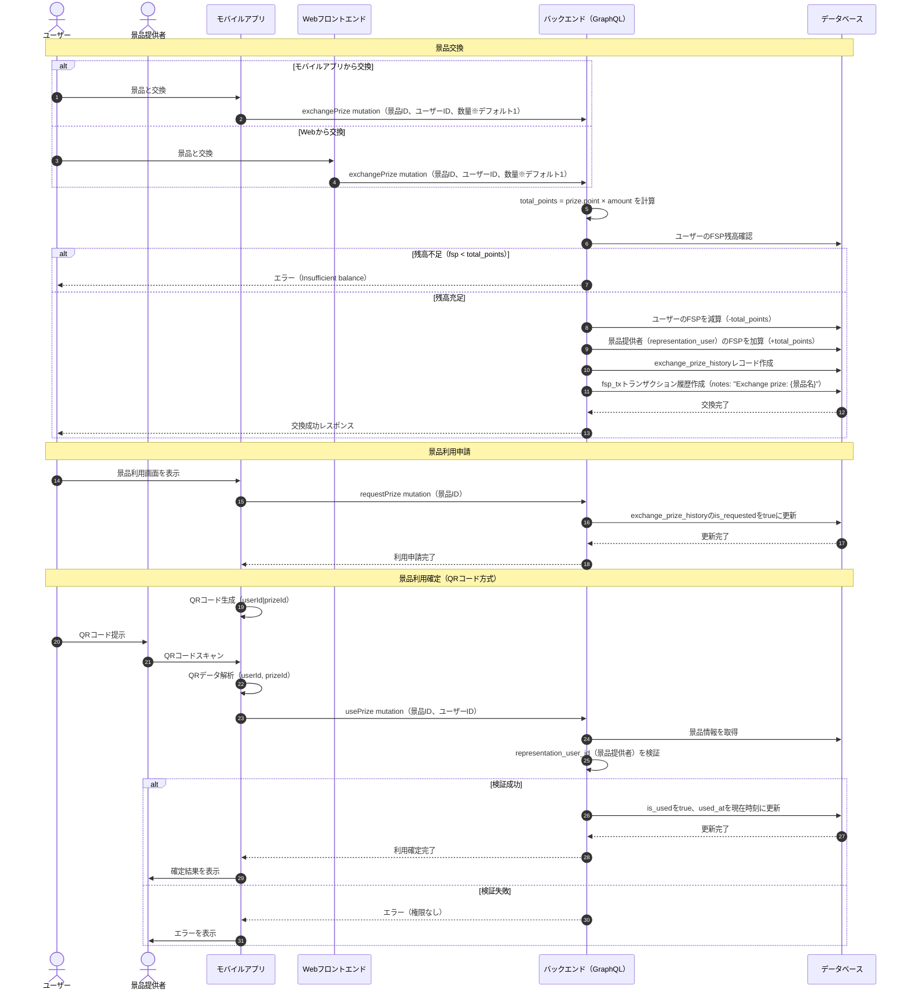
