# 処理フロー図（シーケンス図）

各機能の処理フローをシーケンス図で示します。

---

## 目次

1. [サインイン](#サインイン)
2. [認証](#認証)
3. [クエスト](#クエスト)
4. [ポイントシステム（購入時）](#ポイントシステム購入時)
5. [ポイントシステム（送付時）](#ポイントシステム送付時)
6. [ポイントシステム（特典ポイント）](#ポイントシステム特典ポイント)
7. [ポイントシステム（FSP配分）](#ポイントシステムfsp配分)
8. [ポイントシステム（FSPからクレデンシャルに変換）](#ポイントシステムfspからクレデンシャルに変換)
9. [タスクマッチング（作成時）](#タスクマッチング作成時)
10. [タスクマッチング（完了時）](#タスクマッチング完了時)
11. [AIチャットボット](#aiチャットボット)
12. [クレジット入力時の招待メール配信](#クレジット入力時の招待メール配信)
13. [景品交換](#景品交換)

---

## サインイン

ユーザーはクライアントアプリケーションを通じて、メールアドレスとパスワードまたはGoogle認証を用いてFirebase Authで認証を行います。認証に成功すると、クライアントはFirebaseから取得したFirebase UIDと追加ユーザー情報をバックエンドサーバーに送信します。バックエンドサーバーはデータベースにアクセスし、ユーザー情報を確認・登録後、クライアントにユーザートークンを発行します。最後に、クライアントはユーザーをダッシュボードまたはホーム画面に遷移させます。

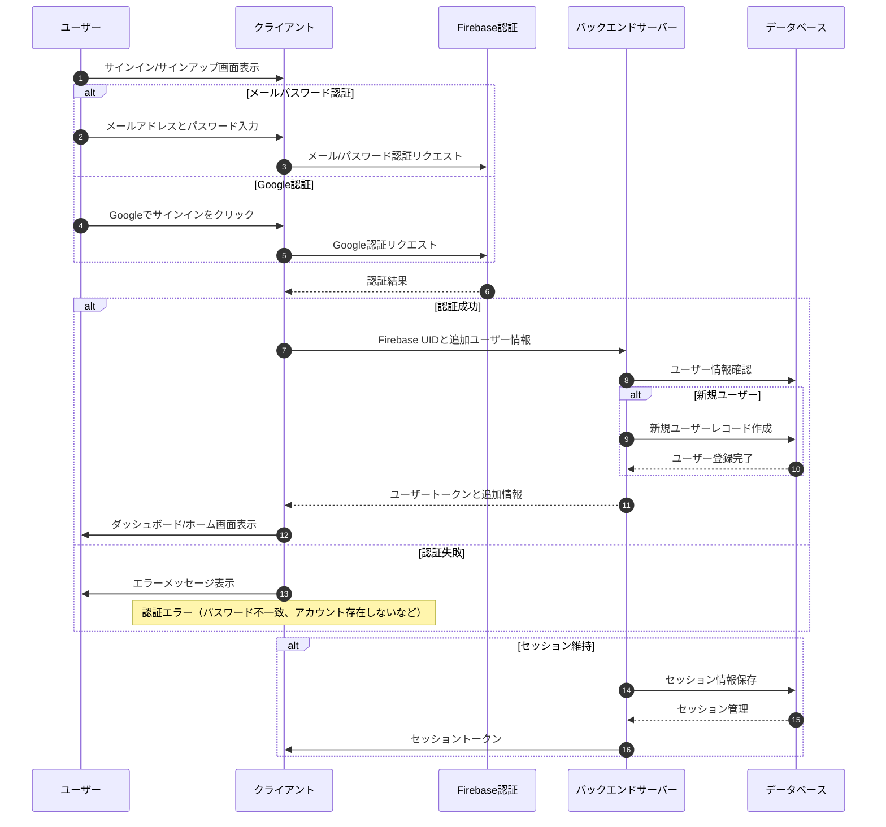

---

## 認証

ユーザーはクライアントアプリケーションを通じて、メールアドレスとパスワードまたはGoogle認証を用いてFirebase認証を行います。認証に成功すると、クライアントはFirebaseから発行されたIDトークンをバックエンドサーバーに送信します。バックエンドサーバーはFirebase認証にトークン検証を依頼し、その結果に応じて処理を分岐します。

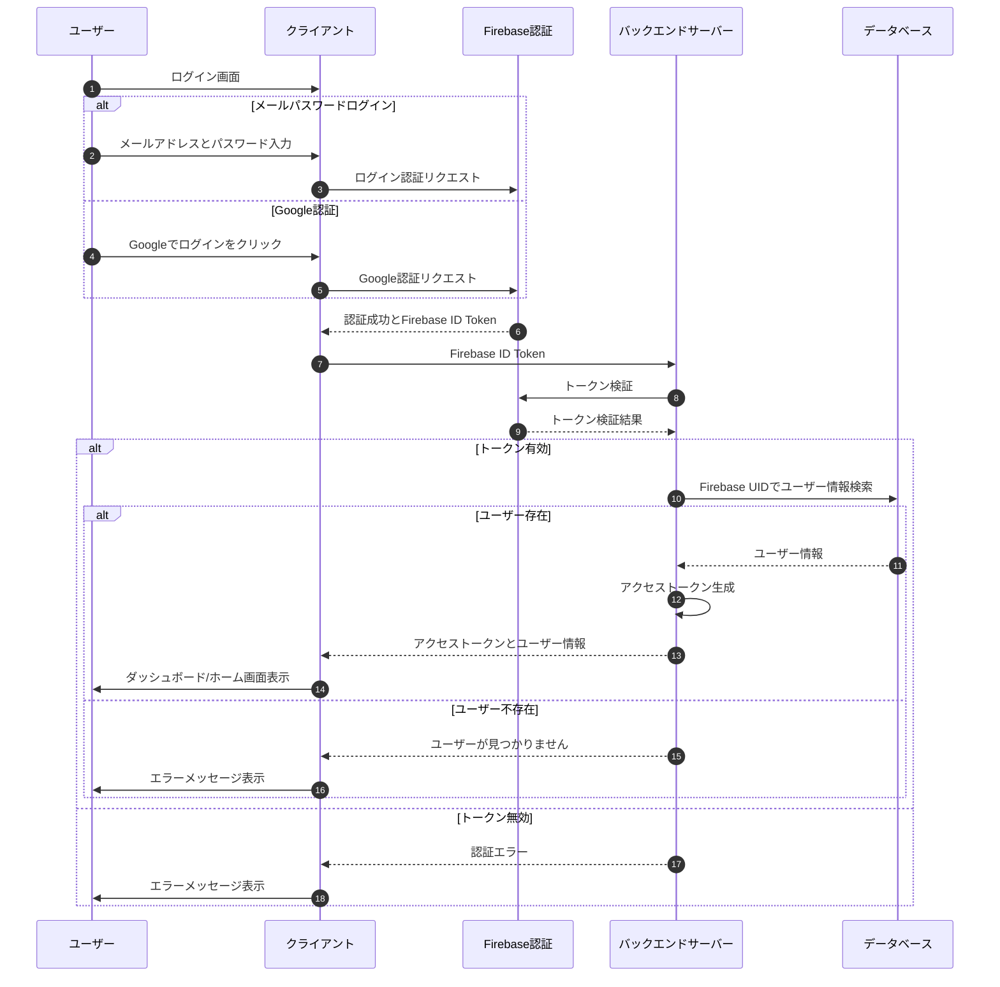

---

## クエスト

クエストオーナーはフロントエンドからクエストを投稿します。フロントエンドはバックエンドを通じてクエストオーナーのポイント残高やカテゴリー一覧などの情報を取得し、投稿ページを表示します。クエストオーナーが入力した情報はバックエンドで検証され、問題なければデータベースに保存されます。ユーザーはフロントエンドからクエスト一覧を閲覧し、参加したいクエストの詳細を確認できます。クエストへの参加やタスク完了報告もフロントエンドから行い、バックエンドはデータベースを更新してポイントの付与や減算などを行います。これらの処理はトランザクションで管理され、データの整合性が保たれます。

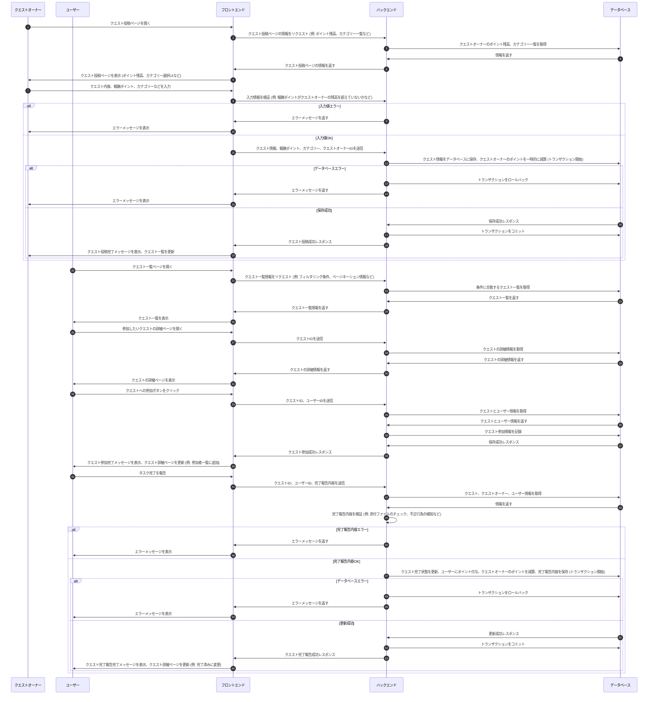

---

## ポイントシステム（購入時）

ユーザーはフロントエンドからポイント購入ページを開き、購入するポイント数を選択します。バックエンドはStripeを用いて決済処理を行い、決済が成功するとデータベースに購入履歴を記録し、ユーザーのポイント残高を加算します。同時に、購入完了メールをユーザーに送信します。決済が失敗した場合は、エラーメッセージをフロントエンドに返却します。これらの処理はトランザクションで管理され、データの整合性が保たれます。

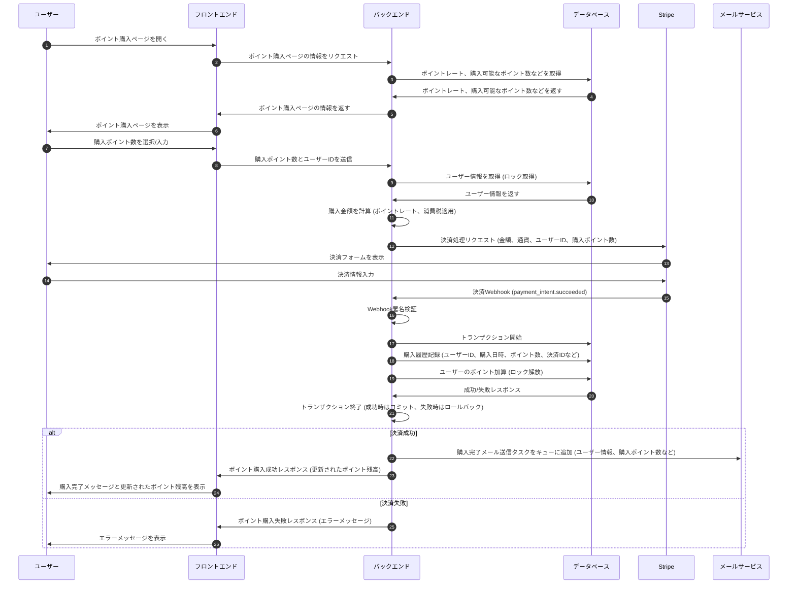

---

## ポイントシステム（送付時）

ユーザーはフロントエンドからポイント送付ページを開き、送付先ユーザーとポイント数、メモを入力します。フロントエンドは入力された情報と送付元ユーザーIDをバックエンドに送信します。バックエンドは送付元ユーザーのポイント残高を確認し、残高が不足している場合はエラーメッセージを返却します。残高が十分な場合は、データベースでトランザクションを開始し、送付元ユーザーのポイントを減算、送付先ユーザーのポイントを加算します。処理が成功すると、送付完了メッセージをフロントエンドに返却し、送付元・送付先ユーザーへの通知処理を非同期で実行します。処理が失敗した場合は、エラーメッセージをフロントエンドに返却します。

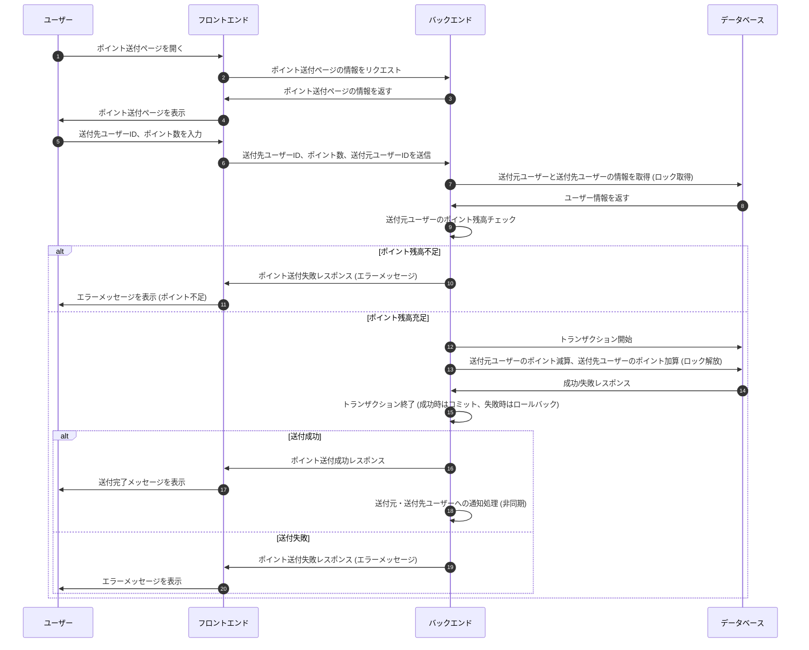

---

## ポイントシステム（特典ポイント）

ユーザーがログインや特定の操作を実行すると、フロントエンドは操作情報とユーザーIDをバックエンドに送信します。バックエンドは、ログインボーナスや操作内容に応じたポイント付与条件を判定し、データベースでトランザクションを開始します。ユーザーのポイントを加算し、処理が成功するとポイント付与成功レスポンスをフロントエンドに返却します。フロントエンドは、ポイント獲得メッセージと更新されたポイント残高をユーザーに表示します。処理が失敗した場合は、エラーメッセージをフロントエンドに返却します。

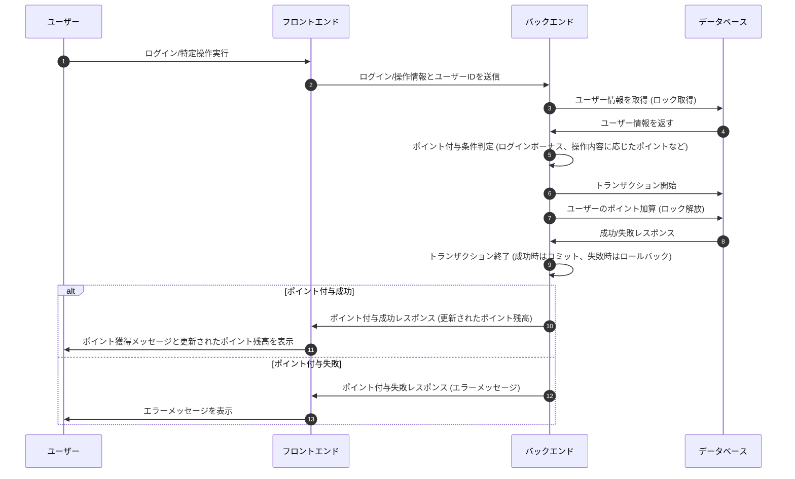

---

## ポイントシステム（FSP配分）

管理者画面で、アドミンユーザーがポイント配分のリクエストを入力します。フロントエンドは、その配分情報をサーバーに送信します。サーバーは、組織データベースにアクセスし、組織アカウントのポイント残高を確認します。もし組織アカウントに十分なポイントがある場合、サーバーは組織データベースのポイントを減らし、ユーザーデータベースの所属ユーザーにポイントを追加します。そして、ポイントを受け取った所属ユーザーに通知が送られます。もし組織アカウントのポイントが不足している場合、サーバーはアドミンユーザーにポイント不足の旨を通知します。

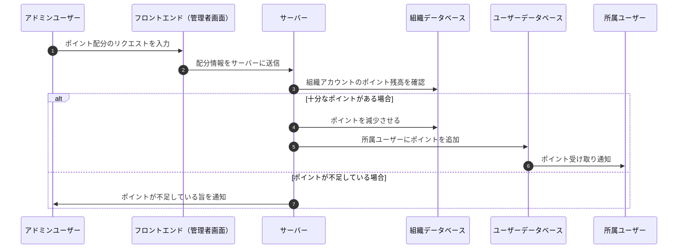

---

## ポイントシステム（FSPからクレデンシャルに変換）

フロントエンドは、ユーザーのウォレットアドレスをバックエンドに通知します。バックエンドは、受け取ったウォレットアドレスをデータベースに格納し、そのアドレスに紐づくポイントのトランザクション履歴を取得します。取得した履歴に基づいて、バックエンドはクレデンシャル計算処理を実行し、計算結果であるクレデンシャル量をスマートコントラクトに送付します。スマートコントラクトは、受け取ったクレデンシャル量を各ウォレットアドレスに送付し、その情報をデータベースにインデックスします。データベースは、インデックスされたデータを取得し、バックエンドに返します。最終的に、バックエンドは処理結果をフロントエンドに返し、フロントエンドはユーザーに最新の残高を表示します。

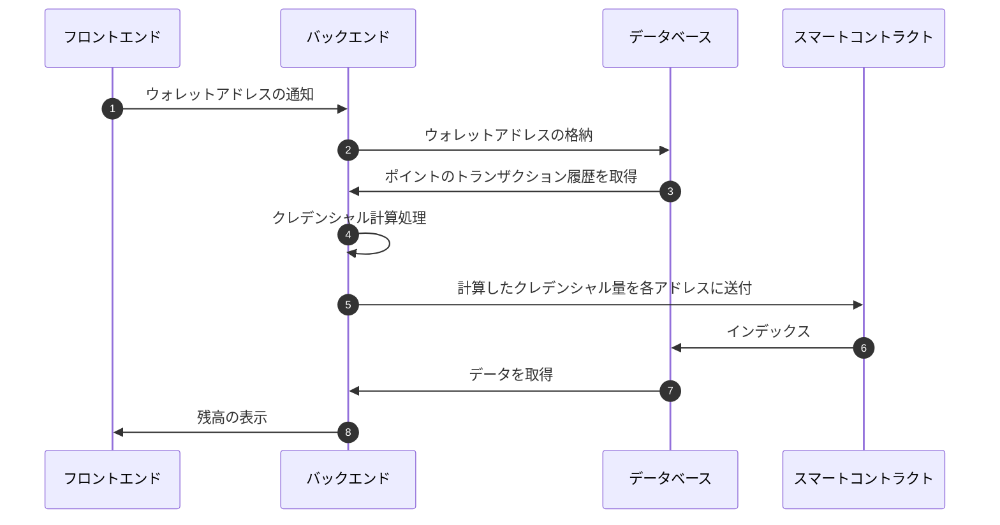

---

## タスクマッチング（作成時）

タスクオーナーは、システムにタスクを公開します。システムは、公開されたタスクの内容をユーザーに表示します。ユーザーは、関心のあるタスクにアプライします。システムは、タスクオーナーにユーザーからのアプライ通知を送信します。募集期間中は、ユーザーとタスクオーナーはシステムを介してメッセージを交換することができます。タスクの遂行条件がクリアされると、タスクオーナーとユーザーはそれぞれシステムに条件クリア確認を通知します。システムは、タスクオーナーとユーザーの双方から条件クリア確認を受け取ると、タスクのステータスを「Ongoing（進行中）」に変更します。

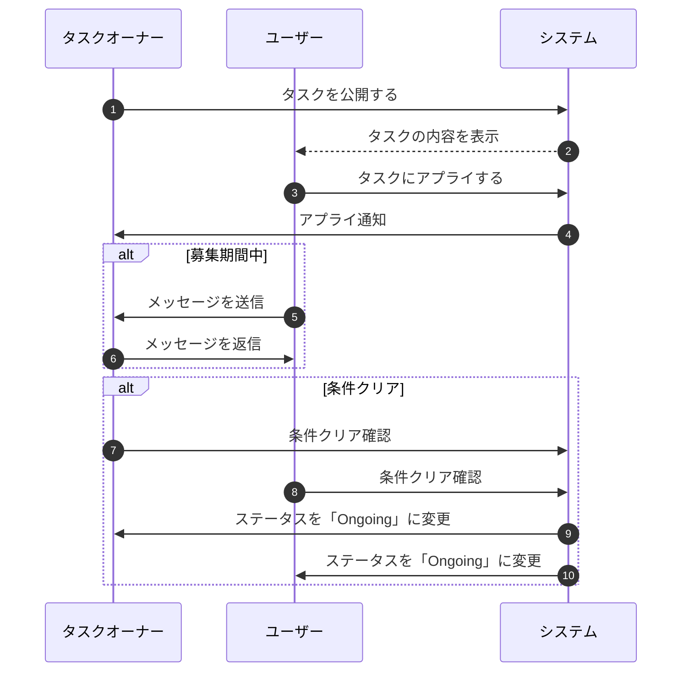

---

## タスクマッチング（完了時）

タスクオーナーがシステム上でタスクのステータスを「finish（完了）」に変更します。システムはタスクオーナーに完了確認メッセージを送信します。タスクが正常に完了した場合、システムはユーザーにタスク完了通知を送信し、ポイントの送信処理を開始します。そして、タスクオーナーにポイントの減少を確認し、ユーザーにポイントの受け取りを確認します。

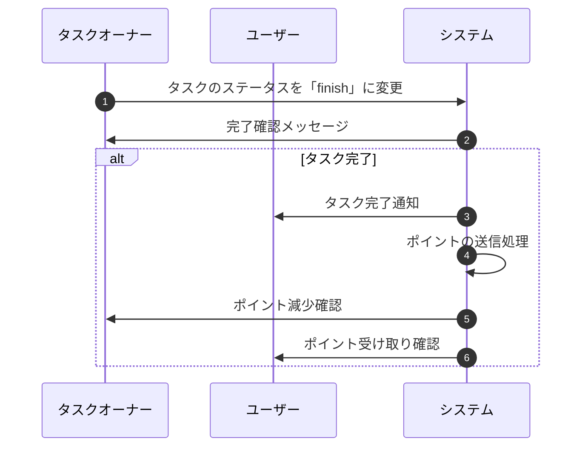

---

## AIチャットボット

ユーザーがフロントエンドのチャットボットUIに質問を送信します。フロントエンドは、受け取った質問をサーバーにリクエストとして送信します。サーバーはユーザー情報を確認し、質問内容とユーザー情報を合わせてGoogle Gemini APIにリクエストします。Gemini APIは、受信した情報に基づいて回答を生成し、サーバーに返します。サーバーは、Gemini APIから受け取った回答をフロントエンドに送信し、フロントエンドはユーザーに回答を表示します。

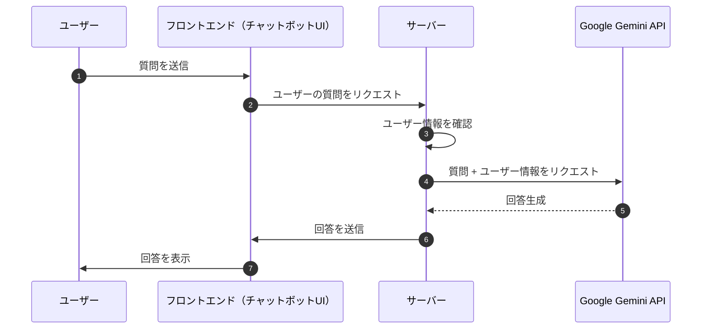

---

## クレジット入力時の招待メール配信

入力ユーザーはフロントエンドの入力フォームでロール、名前、メールアドレスを入力します。フロントエンドは入力された情報をサーバーに送信します。サーバーはクレジット識別のためのハッシュを生成し、ハッシュと共にデータベースに入力情報を保存します。サーバーは定期的にデータベースにアクセスし、楽曲情報を集約します。集約された情報はSendGridを用いてメールで入力されたユーザーに送信されます。入力されたユーザーはメールを受信後、サーバーにアカウント作成リクエストを送信します。サーバーはハッシュコードを要求し、ユーザーが入力したハッシュコードがデータベースの情報と一致すればアカウントを作成します。

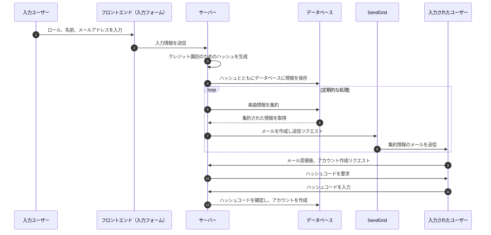

---

## 景品交換

景品の交換と利用のフローです。アプリユーザーと非アプリユーザーで交換・利用方法が異なります。アプリユーザーはモバイルアプリ経由でQRコードを使い、非アプリユーザーは管理画面経由で交換コードを使います。景品提供者は管理画面からコードを検証し、利用を確定します。

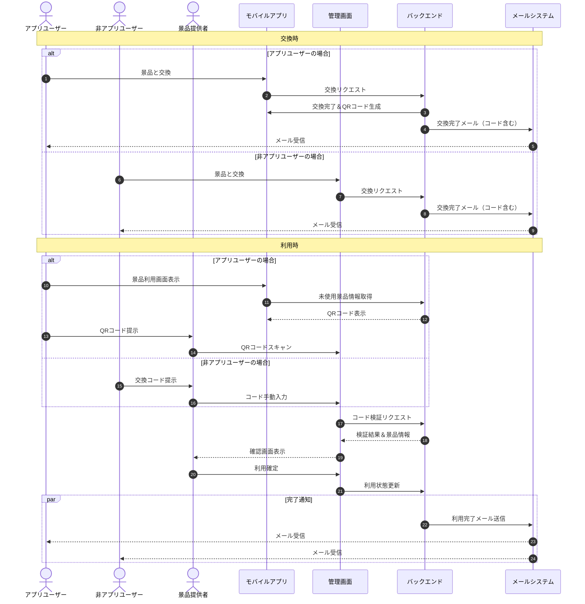
