# 処理フロー図（シーケンス図）

各機能の処理フローをシーケンス図で示します。

---

## 目次

1. [サインイン](#サインイン)
2. [認証](#認証)
3. [クエスト](#クエスト)
4. [ポイントシステム（購入時）](#ポイントシステム購入時)
5. [ポイントシステム（送付時）](#ポイントシステム送付時)
6. [ポイントシステム（特典ポイント）](#ポイントシステム特典ポイント)
7. [ポイントシステム（FSP配分）](#ポイントシステムfsp配分)
8. [ポイントシステム（FSPからクレデンシャルに変換）](#ポイントシステムfspからクレデンシャルに変換)
9. [タスクマッチング（作成時）](#タスクマッチング作成時)
10. [タスクマッチング（完了時）](#タスクマッチング完了時)
11. [AIチャットボット](#aiチャットボット)
12. [クレジット入力時の招待メール配信](#クレジット入力時の招待メール配信)

---

## サインイン

ユーザーはクライアントアプリケーションを通じて、メールアドレスとパスワードを用いてFirebase Authで認証を行います。認証に成功すると、クライアントはFirebaseから取得したユーザー情報をバックエンドサーバーに送信します。バックエンドサーバーはデータベースにアクセスし、ユーザー情報を確認・登録後、クライアントにユーザートークンを発行します。最後に、クライアントはユーザーをダッシュボードまたはホーム画面に遷移させます。

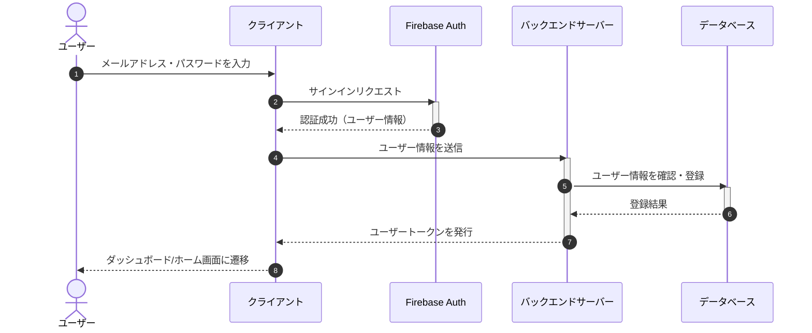

---

## 認証

ユーザーはクライアントアプリケーションを通じて、メールアドレスとパスワードを用いてFirebase認証を行います。認証に成功すると、クライアントはFirebaseから発行されたIDトークンをバックエンドサーバーに送信します。バックエンドサーバーはFirebase認証にトークン検証を依頼し、その結果に応じて処理を分岐します。

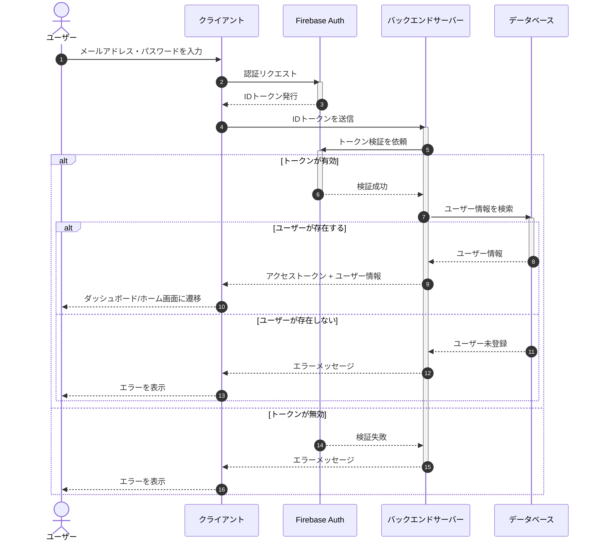

---

## クエスト

クエストオーナーはフロントエンドからクエストを投稿します。ユーザーはクエスト一覧を閲覧し、参加やタスク完了報告を行います。バックエンドはデータベースを更新してポイントの付与や減算などを行い、トランザクションでデータの整合性を保ちます。

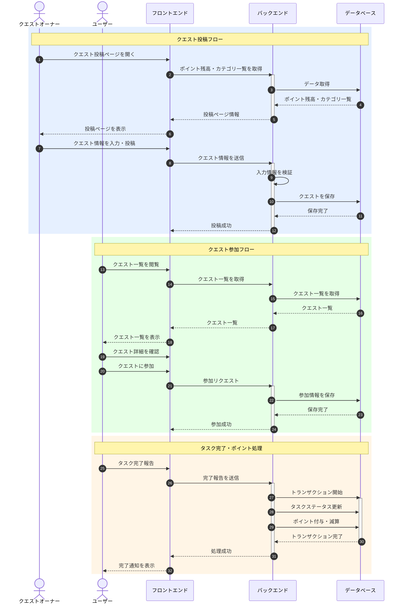

---

## ポイントシステム（購入時）

ユーザーはフロントエンドからポイント購入ページを開き、購入するポイント数を選択します。バックエンドはStripeを用いて決済処理を行い、決済が成功するとデータベースに購入履歴を記録し、ユーザーのポイント残高を加算します。

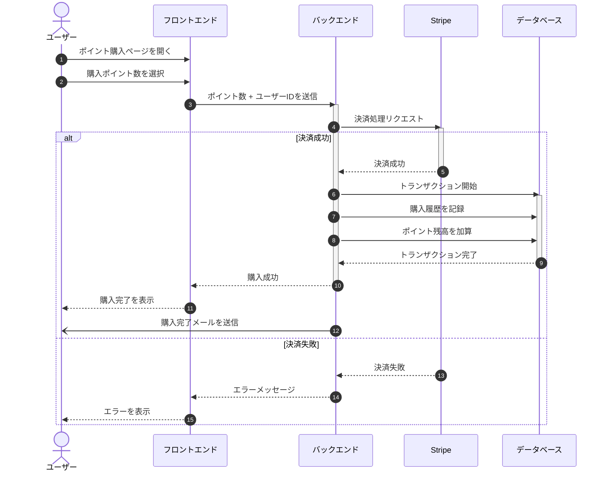

---

## ポイントシステム（送付時）

ユーザーはフロントエンドからポイント送付ページを開き、送付先ユーザーとポイント数、メモを入力します。バックエンドは送付元ユーザーのポイント残高を確認し、十分な残高がある場合にトランザクションでポイントの移動を行います。

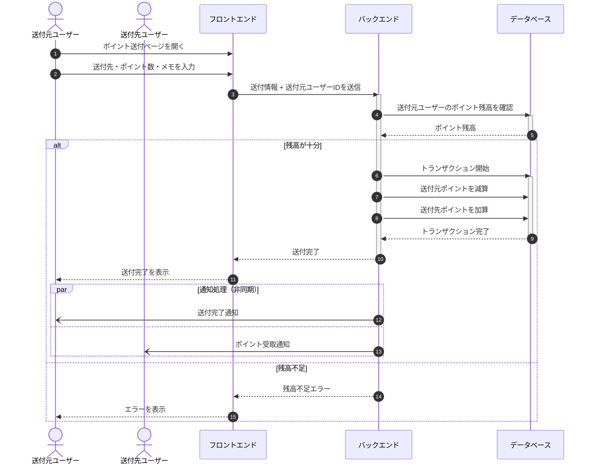

---

## ポイントシステム（特典ポイント）

ユーザーがログインや特定の操作を実行すると、バックエンドはログインボーナスや操作内容に応じたポイント付与条件を判定し、トランザクションでポイントを加算します。

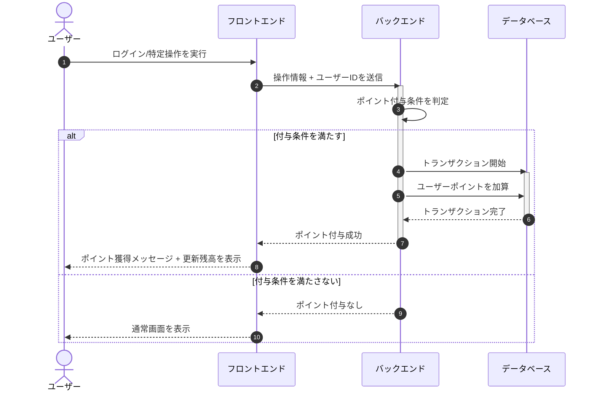

---

## ポイントシステム（FSP配分）

アーティストグループが持つFSPをユーザーに配分するフローです。管理者画面で、アドミンユーザーがポイント配分のリクエストを入力し、組織アカウントのポイントを所属ユーザーに配分します。

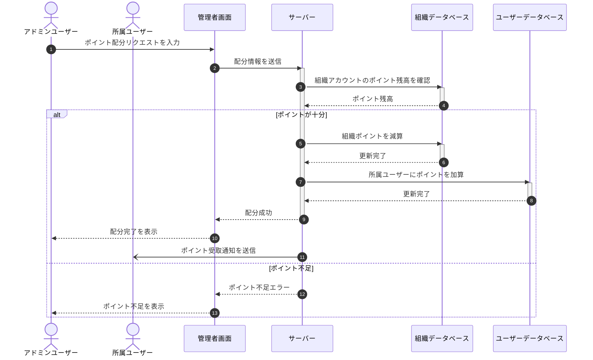

---

## ポイントシステム（FSPからクレデンシャルに変換）

フロントエンドからウォレットアドレスをバックエンドに通知し、ポイントのトランザクション履歴に基づいてクレデンシャルを計算し、スマートコントラクト経由で各ウォレットアドレスに送付します。

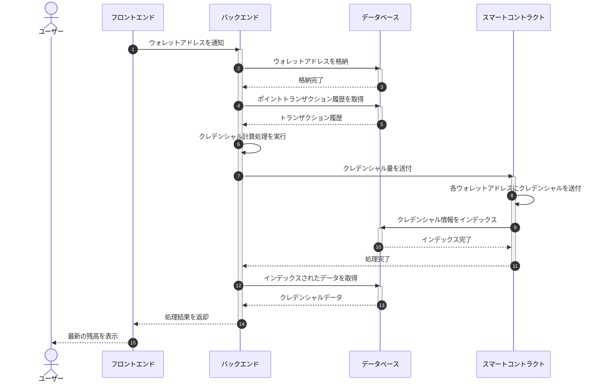

---

## タスクマッチング（作成時）

タスクオーナーがシステムにタスクを公開し、ユーザーがアプライします。募集期間中はメッセージ交換が可能で、遂行条件がクリアされるとタスクのステータスが「Ongoing（進行中）」に変更されます。

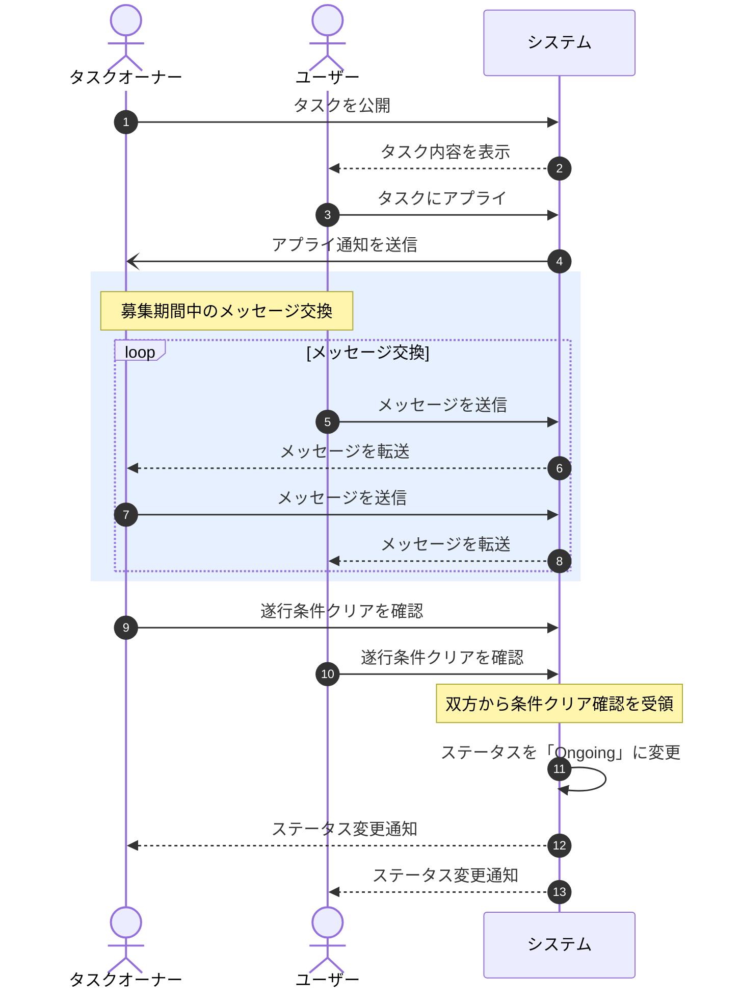

---

## タスクマッチング（完了時）

タスクオーナーがタスクのステータスを「finish（完了）」に変更すると、ポイントの送信処理が行われます。

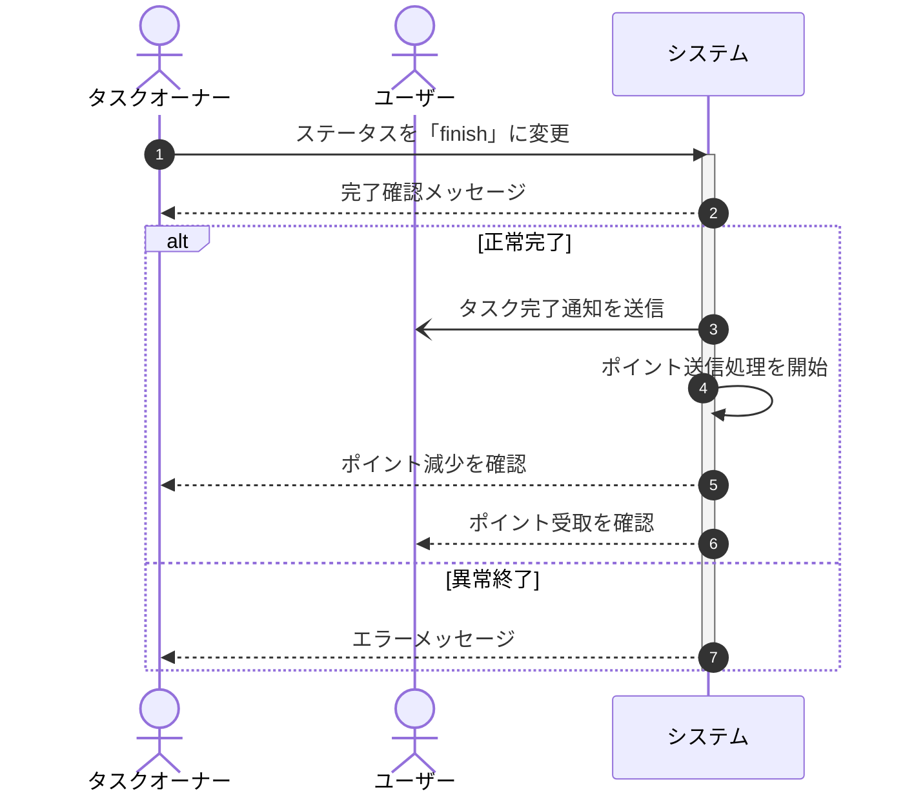

---

## AIチャットボット

ユーザーがチャットボットUIに質問を送信すると、サーバーはユーザー情報と質問内容をGoogle Gemini APIに送信し、生成された回答をユーザーに表示します。

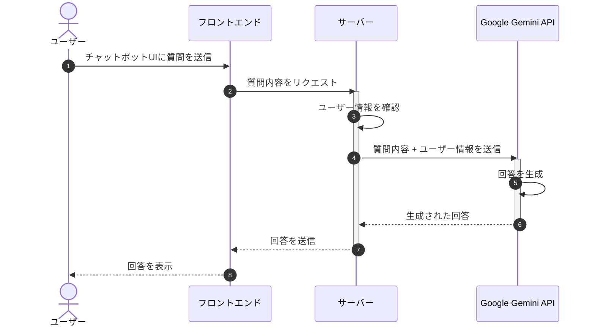

---

## クレジット入力時の招待メール配信

入力ユーザーがクレジット情報を入力すると、サーバーはハッシュを生成してデータベースに保存します。定期的に楽曲情報を集約し、SendGridを用いてメールを送信します。メール受信者はハッシュコードを用いてアカウントを作成できます。

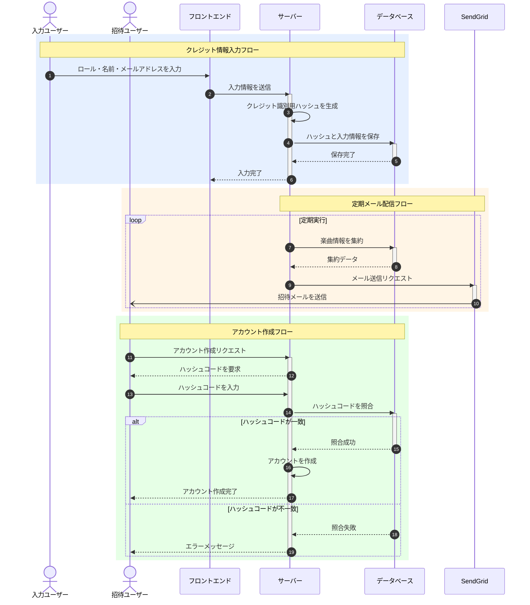
